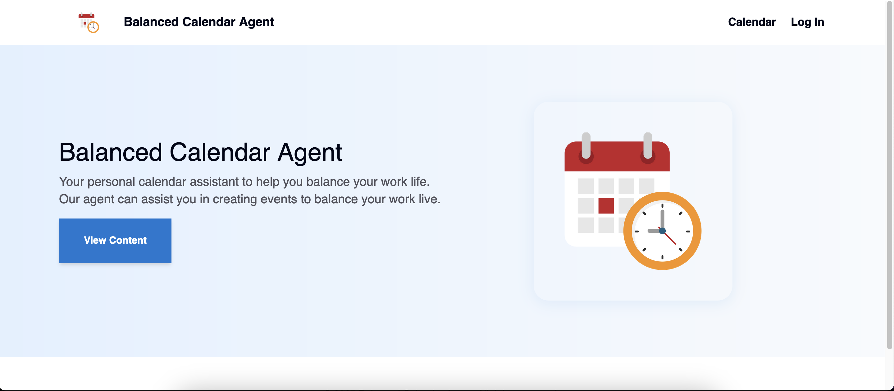

# Project Description

Through my journey in learning AI agents I've read articles about project ideas, gone to hackathons, etc. I've come to learn that calendar agents are very popular so I decided to create one myself.

It is a simple chat interface where can login, connect their google calendar. After logging in and authenticating google calendar, you can ask the agent to help you. It can list, create , delete, updated events, analyze calendar, suggest new recreational events.

# How to Run

Yo will need to create a project and google cloud and enable the google calendar api. You will then get some `credentials.json` which you must save to `./backend`.
Also set your `.env` file with the following. To learn more about Composio go [here](https://composio.dev/)

```
DATABASE_URL=
OPENAI_API_KEY=
COMPOSIO_API_KEY=
```

You can run in docker by going into the root directory of the folder and doing.

```sh
docker compose up --build
```

Or you can run them individually like this

```sh
cd ./backend
make install
make run

cd ./frontend
bun run dev

```

# Demo

Home Page


Analyze events


Getting Event Suggestions


Creating Events


